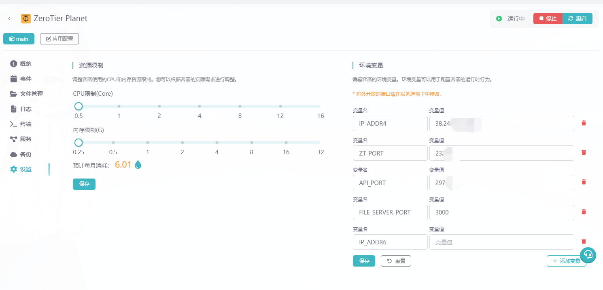

# 文明6联机 - IPv4

> 改自：[xaxys/injciv6](https://github.com/xaxys/injciv6)  
> 本仓库仅保留 **IPv4 客户端联机** 功能，GUI 已精简。

原作者仓库利用ipv6进行联机很方便，但是目前校园网环境通常不支持ipv6，于是进行部分功能添加。
利用 Hook 拦截游戏 UDP 广播，将其改为单播到指定服务器 IPv4 地址，实现基于 IP 的房间发现。

## 使用方法

**注入工具可能被杀毒软件拦截，使用前请关闭 Windows Defender 或添加白名单。**

### 0.前置配置

大体分为两步
第一步所有进行联机玩家先要进入虚拟局域网

> 参照:[docker-zerotier-planet](https://github.com/xubiaolin/docker-zerotier-planet)

第二步加入房间玩家启动gui注入ip

### 1.创建虚拟局域网

[](https://app.rainyun.com/apps/rca/store/6215?ref=220429)
有免费试用，可以试试
从上面链接启动后选择最低配置，3-4个人玩完全没问题，有需求可以自行调整


### GUI 方式（推荐）

1. 启动文明6
2. 以**管理员身份**运行 `kskbl-gui.exe`
3. 在「联机」页填写服务端 **IPv4 地址**
4. 点击「开始注入」，状态显示「已注入」后即可联机

### 命令行方式

1. 启动游戏后双击 `kskbl.exe` 注入
2. 在游戏目录编辑 `kskbl-config.txt`，填入服务器 IPv4 地址
3. 再次运行 `kskbl.exe` 使配置生效
4. 解除注入：运行 `civ6remove.exe`

### IPv4 联机说明

- 需先搭建虚拟局域网或确保客户端能访问服务端 IPv4
- **服务端无需注入**，仅**客户端**注入并配置服务端地址
- 分享工具时请将以下文件放在同一目录：`kskbl-gui.exe`、`kskbl.exe`、`hookdll64.dll`、`civ6remove.exe`

游戏目录一般为：

`Sid Meier's Civilization VI\Base\Binaries\Win64Steam` 或 `Win64EOS`

## 编译

需要 MinGW-w64（i686 + x86_64）和 Go 1.21+。

```bat
env.bat
mingw32-make SHELL=cmd.exe
```

## 原理简述

1. Hook `sendto`：将局域网 UDP 广播改为单播到配置的服务器 IPv4
2. Hook `recvfrom`：将收到的地址映射为 `127.0.127.x` 假地址，规避游戏对私有 IP 的过滤
3. Hook `select` / `closesocket`：配合上述 socket 操作

IPv4 联机完成房间发现后，沿用游戏原生联机机制，无需额外 Hook。

## 致谢

感谢原作者 PeaZomboss 的注入框架，以及 xaxys 的 injciv6 项目。
